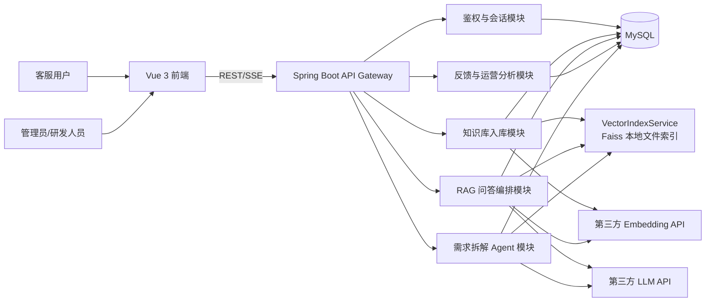
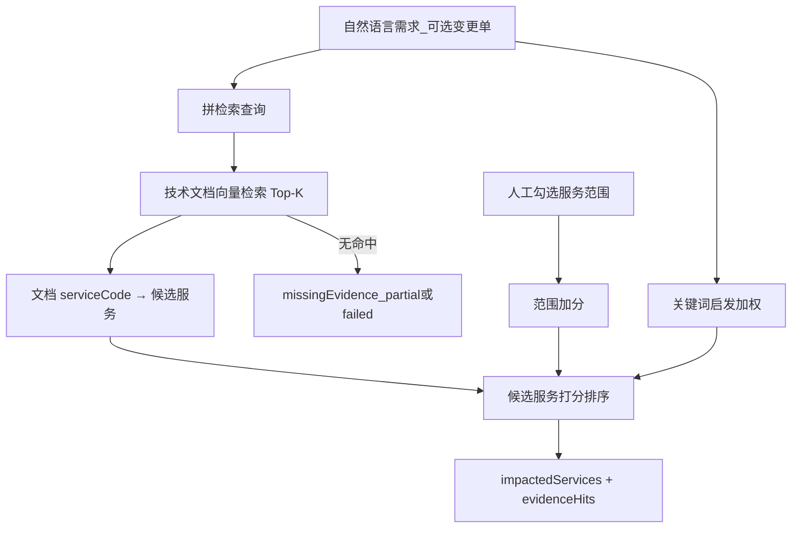
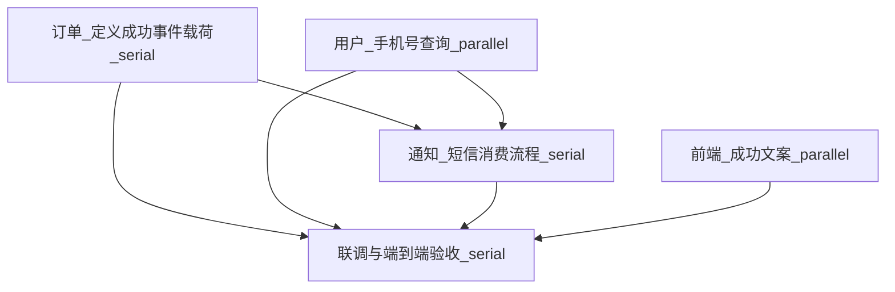
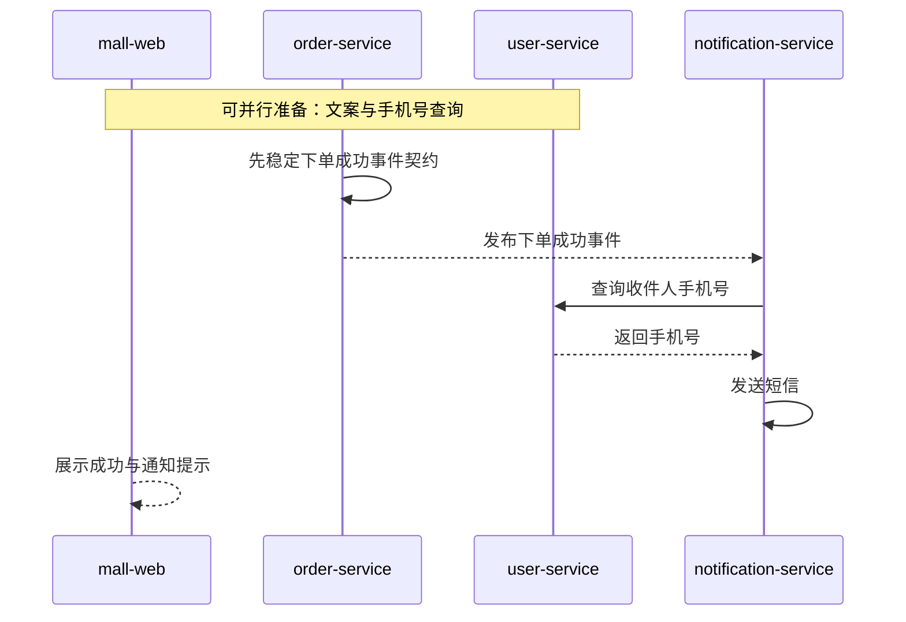

# 项目说明

## 1. 项目定位

本项目是一个面向企业场景的 AI 智能客服系统，完成一套基于大语言模型的企业知识问答方案，并进一步扩展出“研发需求拆解 Agent”能力，使系统更接近真实业务场景。

系统分为两条核心能力线：

1. 面向客服场景的 RAG 问答链路
2. 面向研发协同场景的需求拆解 Agent 链路


## 2. 推荐技术选型

### 2.1 总体选型

| 层级 | 选型 | 说明 |
| --- | --- | --- |
| 前端 | Vue 3 + TypeScript + Vite + Pinia + Vue Router | 符合 README 可选栈，适合聊天页、后台页、状态管理 |
| 组件库 | Element Plus | 适合企业后台、表格、对话框、上传组件 |
| 后端 | Java 21 + Spring Boot 3.3 | 符合 README 要求，适合企业级分层架构和 API 规范化 |
| Web 层 | Spring MVC + `SseEmitter` | 满足流式输出要求，兼顾实现复杂度和稳定性 |
| 安全 | Spring Security + JWT | 适合登录鉴权、接口保护和会话所有权控制 |
| 数据访问 | Spring Data JPA + MyBatis-Plus（二选一，首推 JPA） | JPA 适合主业务模型，复杂统计查询可补充原生 SQL |
| 关系数据库 | MySQL 8.4 | 存储用户、会话、消息、知识库、Agent 规划数据 |
| 向量索引 | Faiss 本地文件模式（IndexFlat 精确余弦） | 对齐 FAQ：无需独立向量服务；落盘可重启复用，比 Chroma 免 Docker |
| 文档解析 | Apache PDFBox / CommonMark / 原生文本读取 | 覆盖 `.txt` / `.md` / `.pdf` |
| LLM 接入 | 第三方 OpenAI-compatible API 接口适配层 | 预留 `Base URL / API Key / Model` 配置，便于切换 OpenAI、通义千问兼容接口、Kimi、DeepSeek 等 |
| Embedding 接入 | 第三方 Embedding API 接口适配层 | 与生成模型解耦，支持单独切换 embedding 供应商 |
| 流式输出 | SSE | 前端可逐字渲染 |

### 2.2 技术选型原因

#### 为什么选 Vue 3

1. README 允许 Vue 3 + TypeScript。
2. Vue 3 在企业管理后台与业务表单场景中开发效率高。
3. 结合 Element Plus，适合快速搭建聊天页、文档管理页、管理后台和 Agent 规划页。

#### 为什么选 Spring Boot

1. Spring Boot 适合做标准企业后端，分层清晰，便于展示工程能力。
2. Spring Security、JPA、Validation、SSE、OpenAPI 等生态成熟。
3. 更贴近真实业务中的多服务改造与 Agent 编排场景。

#### 为什么选“第三方 API 适配层”而不是本地 Ollama


1. 系统不绑定某个具体大模型厂商。
2. 通过统一的 `Base URL + API Key + Model` 配置，可以快速接入不同供应商。
3. 更接近真实企业实践：测试、预发、生产环境往往会切换不同供应商或不同模型。
4. 此类复杂规划任务通常更依赖高质量商用 API。

#### 向量索引：Faiss 本地文件模式

实现类：`VectorIndexService`。

1. **选型**：题目 FAQ 允许 Chroma / Faiss 本地文件模式且不强制独立服务。本项目选用 **Faiss 本地文件模式**（未选 Chroma，因 Chroma 默认仍常需独立进程）。
2. **实现**：与 Faiss `IndexFlatIP` 同类的精确余弦检索；向量与 `kbId` / `serviceCode` / `priority` 等 metadata 写入 `FAISS_INDEX_DIR`（默认 `backend/data/faiss-index/index.json`）。
3. **生产向能力**：删除按 `vectorId` 同步；同内容 upsert 跳过重新 Embedding；重启从磁盘加载；知识库/服务码过滤。语料更大时可升级为 Faiss HNSW/IVF，接口不变。
4. **不依赖 Qdrant**：不再要求 Docker 向量库即可完整跑通 RAG / Agent。

## 3. 系统总体架构



### 3.1 两条业务主链路

#### 客服问答链路

1. 用户提问
2. 检索知识库
3. 拼接 Prompt
4. 调用第三方 LLM
5. SSE 流式返回
6. 展示引用来源
7. 记录反馈和评估信息

#### 需求拆解 Agent 链路（研发变更规划）

1. 输入变更需求（可选变更单号/优先级）与系统技术文档
2. 检索服务目录、接口文档、事件文档
3. 识别受影响的微服务（问题 A）
4. 判断并行任务和串行任务（问题 B / C）
5. 生成任务 DAG、建议发布顺序与人工评审清单
6. 在「研发变更规划」工作台展示，供变更评审（不自动改多仓代码）


### 4.0 完成结论

**已完成（可演示的实现 + 本文流程图/示例，而非仅设想）。**

| README 要求 | 本项目落地情况 |
| --- | --- |
| 判断改哪些微服务 | ✅ 语义信号 + 技术文档检索 + 服务目录打分 → `impactedServices` / `evidenceHits` |
| 判断可并行改动 | ✅ `executionMode=parallel` + `parallelGroups`；工作台单独展示 |
| 判断必须串行/依赖顺序 | ✅ `service_dependencies` 建边 + 领域兜底；`dependsOn` + `suggestedReleaseOrder` |
| 流程图 / 示例说明 | ✅ 见 §4.2–§4.4；`docs/AI架构设计.md` §5、`docs/业务流程说明.md` §6 |
| 项目内实现更好 | ✅ 「研发变更规划」工作台 + `AgentPlannerService` + `/api/v1/agent/*` |

代码入口：`AgentPlannerService.java`、`AgentDecomposeView.vue`（侧栏「研发变更规划」）。

**边界说明：**

1. 当前是「证据驱动的**规划** Agent」，输出改动计划与依赖，**不自动生成各服务业务代码**（与题目「不要求完整代码」一致）。
2. 与客服 RAG **业务隔离**：客服走 support 库 + `ChatService`；变更规划走 technical 库 + 服务目录/依赖表。

### 4.1 能力定义

输入：自然语言需求、可选变更单元数据、可选服务范围、技术文档库、服务目录与依赖表。  

输出：影响服务及理由、任务 DAG（并行/串行）、建议发布顺序、验证步骤、人工评审清单、证据不足提示。

### 4.2 三个核心问题的解决方案

#### 问题 A：如何准确判断要改哪几个微服务？



原则：谁拥有契约/事件/副作用数据/结果展示，谁入选；无证据不强行编造服务名。

#### 问题 B：哪些改动可以同时进行？

1. `dependsOn` 为空且 `executionMode=parallel` → 可并行。  
2. 互不依赖的准备工作可并行（例：手机号查询 ↔ 成功页文案）。  
3. 共享未稳定上游契约的消费改造不可并行。

#### 问题 C：哪些改动必须按先后顺序？

| 依赖类型 | 含义 | 示例 |
| --- | --- | --- |
| event | 下游消费的事件须先由上游定义 | 订单成功事件 → 通知消费 |
| data | 所需字段须先可查询 | 手机号查询 → 短信发送 |
| api / config | 调用方或展示依赖契约/配置 | 订单结果 → 前端展示 |

串行原则：先稳上游契约 → 再改下游消费 → **联调验收永远在最后**；有 `dependsOn` 的任务不得进并行组。

### 4.3 完整示例：「用户下单后自动发送短信通知」


**（A）改哪些微服务**

| 服务 | 为什么要改 |
| --- | --- |
| order-service | 定义/补齐下单成功事件与载荷 |
| user-service | 提供可校验的手机号查询 |
| notification-service | 消费事件并发送短信 |
| mall-web | 成功页展示发送结果文案 |

**（B）可同时进行**

- 用户服务：开放并校验手机号查询  
- 前端：更新成功状态文案  

**（C）必须先后顺序**



文字版：

```text
订单事件契约（先） ──┐
                      ├──► 通知短信消费 ──► 联调验收（最后）
用户手机号能力（可与前端并行）┘
前端成功文案（可与用户侧并行，不挡通知）
```

运行时序（便于理解依赖）：



建议发布顺序示例：`order-service` → `user-service` → `notification-service` → `mall-web`（再联调）。

### 4.4 拆解流水线

落在 `AgentPlannerService`：

1. `parseSignals` → 2. 技术库检索 → 3. 打分/`impactedServices` → 4. 读依赖表两阶段 `buildTasks` → 5. `parallelGroups` → 6. `suggestedReleaseOrder` / `reviewChecklist` → 7. `validatePlan` → 8. 落库 `agent_plans` → 工作台展示。


### 4.5 继续改造，应如何做（不损害已有功能）

**原则：只扩展变更规划子域，不动客服 RAG 主链路。**

| 改造项 | 做法 | 对现有功能的影响 |
| --- | --- | --- |
| 增强服务识别准确率 | 丰富技术库与依赖表 | 无影响客服问答 |
| 更通用的依赖推断 | 减少硬编码服务名分支 | 仅影响规划页输出 |
| 引入 LLM 润色规划 | 仅改写说明文案，禁止改服务集合与依赖边 | 客服链路不变 |
| 人工确认闸门 | 规划「确认后锁定」状态 | 纯新增 |

**明确不做：** 不把 Agent Prompt 混进客服 System Prompt；不让规划检索改写客服路由。

### 4.6 为什么这套设计更接近真实业务

真实研发拆解不同时考虑：

1. 微服务边界  
2. API / 事件契约  
3. 数据依赖  
4. 可并行的人力窗口  
5. 联调与上线风险  

本项目做成系统内建能力：用文档证据回答「改谁」，用依赖规则回答「谁先谁后」，用并行组回答「谁能一起做」，并用 `partial/failed` 暴露证据不足，而不是假装拆得很准。

## 5. AI 工程重点思考

### 5.1 如何处理检索为空

1. 当向量检索无结果或最高分低于阈值时，直接走兜底分支。
2. 兜底话术必须明确说明“当前知识库没有足够依据”。
3. 禁止模型自由发挥。
4. 可引导用户补充更明确的上下文。

### 5.2 如何处理上下文超长

采用三层证据打包：

1. 强规则层：政策、SLA、禁答条款
2. 相关证据层：相似度较高的知识片段
3. 历史对话层：最近 N 轮消息

裁剪顺序：

1. 先去重
2. 再合并相邻片段
3. 最后做抽取式压缩

### 5.3 如何降低 LLM 幻觉

1. Prompt 强制“只能使用编号证据”，禁止混写不同文档规则  
2. 空检索直接兜底，不调用 LLM 编造细则  
3. 输出可标注（依据 E1/E2），消息侧携带引用 id  
4. 有证据时低 temperature（售后/投诉更低）  
5. 意图分类注入专属约束（售后禁估算天数、投诉禁乱承诺）  

#### Prompt 优化前后对比（摘要）

| 项目 | 优化前 | 优化后 |
|------|--------|--------|
| 证据约束 | “优先依据证据” | “只能用 [E#] 证据，否则说不确定” |
| 意图 | 无 | 四类意图 + 条件 Prompt |
| 温度 | 偏固定 | 有证据 0.1–0.15 / 无证据 0.4 |

人工验证建议见 `docs/AI架构设计.md` §6.3。

### 5.3.1 意图识别（加分项）

在调用 RAG / 回答 LLM 前由 `IntentClassifier` 完成分类，标签写入助手消息与会话 `lastIntent`，前端会话气泡展示：

- 四类意图：产品咨询 / 售后问题 / 闲聊 / 投诉（对齐 README）
- **优先 LLM 智能分类**（短 Prompt + `temperature=0`，复用 `LlmCallRetry` 超时/限流重试）
- LLM 输出无法解析、或重试耗尽：自动**降级到关键词/正则规则**（`matchedSignals` 以 `rules-fallback:` 标记）
- 追问建议与 Prompt 约束随意图切换；闲聊跳过知识库检索

### 5.4 如何满足大规模知识检索场景

实现说明（详见 `docs/AI架构设计.md` §8）。

代码路径：`EvidenceGovernanceService` → `ChatService` → 分层 Prompt（`OpenAiCompatibleChatClient`）。

采用“规则优先 + 分层摘要 + 分步校验”：

1. 阈值过滤后按 `policy` 与相关度分成 `must_keep_policy` / `high_relevance` / `background`
2. 政策证据优先占用上下文预算（约 45%），背景层做抽取式压缩而非整段塞入
3. 同文档相邻片段合并、重复去重，统一编号 `E1…En`
4. Prompt 显式分三层并约定冲突时政策优先、禁止混写新规则
5. 生成后校验回答中的关键数字是否出现在证据中；失败则降级为证据摘要（`answerStatus=degraded`）
6. SSE 透出 `evidencePacking`，便于对照 Top-K 放大时的入模结构
## 6. 模块拆分建议

### P0 必做

1. 用户鉴权模块
2. 会话与消息模块
3. 知识库上传与索引模块
4. RAG 检索与生成模块
5. SSE 流式输出模块
6. 反馈与评估模块

### P1 加分

1. 意图识别
2. 追问建议
3. 管理后台（仅 `ADMIN` 角色；演示账号为管理员，自注册默认为 `USER`）
4. 多知识库路由
5. 大规模检索下的分层摘要与规则校验

### P2 终极挑战

1. 服务目录建模
2. 技术文档知识库化
3. 需求拆解 Agent
4. 任务 DAG 生成
5. 并行/串行任务识别

详细拆分见上文 **§4 第 6 点（终极挑战）完成情况与问题解答**，以及 `docs/AI架构设计.md` §5、`docs/业务流程说明.md` §6。

## 7. 推荐目录

```text
project/
├── backend/
│   ├── src/main/java/com/company/aics/
│   │   ├── api/
│   │   ├── application/
│   │   ├── domain/
│   │   ├── infrastructure/
│   │   ├── rag/
│   │   ├── agent/
│   │   └── config/
│   ├── src/main/resources/
│   ├── sql/
│   ├── pom.xml
│   └── README.md
├── frontend/
│   ├── src/
│   │   ├── api/
│   │   ├── views/
│   │   ├── components/
│   │   ├── stores/
│   │   ├── router/
│   │   └── composables/
│   ├── package.json
│   └── README.md
├── docs/
└── .codeartsdoer/skills/
```

## 8. 使用 AI 编程工具的说明

### 8.1 使用了哪些 AI 工具

| 类型 | 工具 | 用途 |
|------|------|------|
| 编程助手 | Cursor，Codex（Composer / Agent） | 前后端脚手架、RAG/SSE、管理后台、Agent 拆解、文档草稿、问题排查 |
| LLM API（业务推理） | 阿里云 MaaS OpenAI 兼容接口，模型 `qwen-plus` | 客服流式问答生成 |
| Embedding API | 同工作空间兼容接口，模型 `text-embedding-v3` | 知识切块与查询向量化；失败时回退本地哈希向量 |
| 未使用 | LangChain / LlamaIndex | 为展示对 RAG 步骤的理解，检索—拼装—生成链路均为手写 |

配置方式见根目录 `.env.example` 与 `运行指南.md`（`LLM_*` / `EMBEDDING_*`）。演示账号：`demo@qq.com` / `Passw0rd!`。

### 8.2 构建 RAG 链路时，对 AI 生成代码做过的优化与修正

AI 助手生成了相当比例的初稿（Controller、切块、OkHttp 调用、前端 SSE 解析等）。以下是人工或在助手协助下反复修正、对正确性影响最大的点：

1. **持久化路径纠偏**  
   初稿/中间态曾出现业务走内存 `DemoDataStore`、种子写 MySQL 的双轨问题。已统一为 `AppDataStore` + JPA/MySQL，并恢复启动类对数据源/JPA 的启用，保证会话、反馈与知识库元数据可持久。

2. **流式输出稳定性**  
   - 强制 HTTP/1.1、合理超时；Windows 下同步链路保留 PowerShell 回退。  
   - SSE 使用命名事件（`message_start` / `token` / `citation` / `message_end` / `error`），前端按帧解析，避免等整段再渲染。  
   - **超时 / 429 / 5xx**：`LlmCallRetry` 指数退避重试（默认最多 3 次，`LLM_MAX_ATTEMPTS` / `LLM_RETRY_*`）；尊重 `Retry-After`；鉴权与模型不可用不重试。流式仅在尚未吐出 token 时重试，避免半截重复。  
   - 重试仍失败时降级为证据摘要流式输出（`answerStatus=degraded`），而不是整段挂死。

3. **空检索与弱相关“硬塞”问题**  
   早期存在低于阈值仍软回退进 LLM 的逻辑，易导致「订单发货」类问题串到退货政策并编造细则。已改为：**低于 `RAG_SCORE_THRESHOLD` 一律丢弃 → 标准兜底**，有证据才调模型。

4. **Prompt 与幻觉控制**  
   从笼统的「优先依据证据」改为：编号证据 `[E#]`、禁止混写不同文档规则、意图条件 Prompt、有证据时低温（售后/投诉更低）。详见 `docs/AI架构设计.md` §6。

5. **检索与入库工程化**  
   - Top-K=12、阈值默认 0.22、上下文 6000 字、入模最多 5 条，并在文档中写明原因。  
   - 文档状态 `processing → ready/failed` 异步向量化；删除时同步清向量。  
   - 多知识库自动路由（`kbId≤0`）跨客服库选最高分库。

6. **模型配置踩坑**  
   工作空间无 `deepseek-r1` 时上游返回 `model_not_found`，前端表现为「模型不可用，已回退为证据摘要」。已改为可用的 `qwen-plus`，并在 `.env.example` 同步。

7. **Agent 拆解**  
   初稿偏“一次 LLM 直接出 DAG”。现行实现为：技术库检索 + 服务目录启发 + 并行组规则 + 落库规划，避免无证据时空口拆服务。

### 8.3 如何评估和验证 RAG 回答质量

以**人工问答集 + 状态字段观测**为主（未接自动化评测平台），最小验证集如下：

| 用例 | 期望 | 如何判定 |
|------|------|----------|
| 「退货有时间限制吗？」 | 命中退换货政策；有引用；`answerStatus=success` | 引用文档名含政策；正文天数与证据一致 |
| 「订单多久发货？」 | 命中发货/物流相关 FAQ 或产品说明，**不串退货规则** | 引用与正文不出现无关退货条款 |
| 明显无关问题 | `fallback` 兜底话术，不编造细则 | `answerStatus=fallback`，无虚假数字 |
| 多轮追问 | `historyRounds` 携带最近 N 轮 | 第二问能承接第一问上下文 |
| 「我要投诉」 | 意图=投诉；语气安抚且不乱承诺赔偿 | 气泡意图标签 + 回答内容 |
| 上传新文档后提问 | 增量向量化后可检索到新内容 | 文档先 `processing` 再 `ready`，问答能引用新文件 |
| 变更规划：「下单后发短信」 | 标出订单/通知/用户等服务及并行/串行 | 工作台可见影响面、DAG、发布顺序 |

回归方式：改 Prompt/阈值后，用同一批问题对比引用是否漂移、兜底率是否异常升高。管理后台可查看日提问量、好评率与兜底率作辅助。

### 8.4 数据初始化

系统启动时由 `DataSeeder` 完成：

1. 预置客服库三篇文档（classpath `seed/`）：`公司产品介绍.txt`、`常见问题FAQ.md`、`退换货政策.txt`（合计约 2000–5000 字量级，便于测检索）。  
2. 预置技术文档库若干短篇，供 Agent 使用。  
3. 切块后写入 MySQL，并 upsert 到 **Faiss 本地文件索引**（`data/faiss-index`），启动后即可直接问答；再次启动时同内容可复用已落盘向量。  
4. 若库中已有用户，则跳过重复种子，仅对已有文档重建/对齐向量索引。

## 9. 结论

这套方案相较于简单的“客服问答 Demo”，更接近真实企业业务：

1. 外部有客服问答场景
2. 内部有技术文档与服务治理场景
3. AI 不只回答问题，还能帮助拆解研发需求


