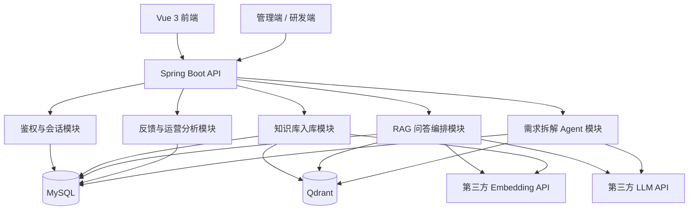
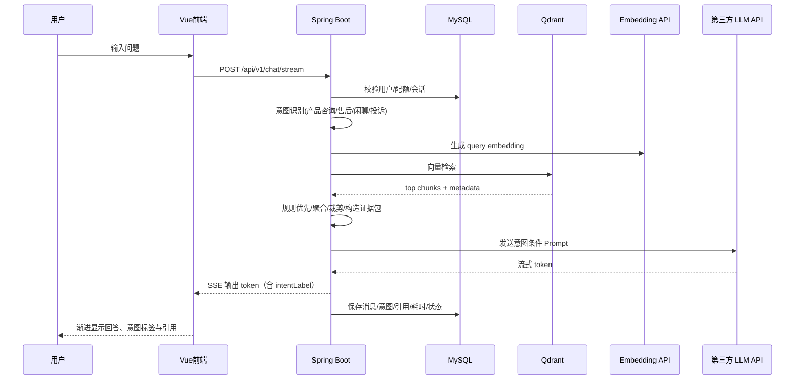
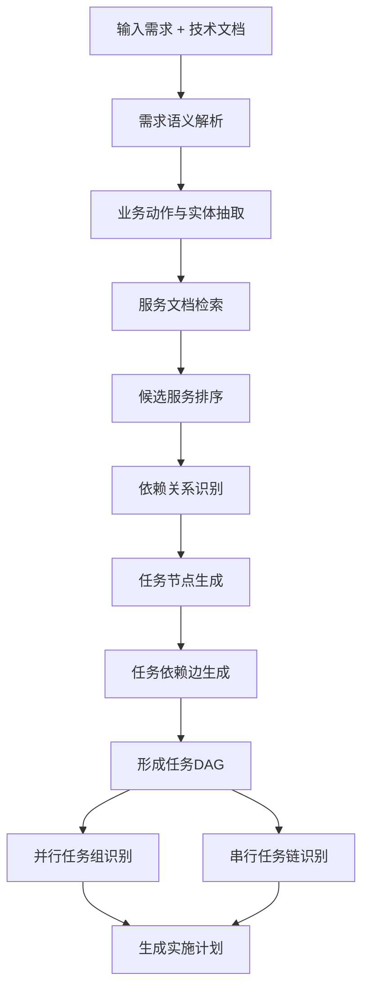

# AI架构设计

## 1. 设计目标

本项目的 AI 架构要同时覆盖两类真实业务能力：

1. 企业知识客服问答
2. 研发需求拆解 Agent

因此整体设计不是一个单纯的聊天机器人，而是一套“文档检索 + 推理生成 + 任务规划”的企业 AI 平台。

架构目标如下：

1. 完整实现 README 要求的 RAG 主链路
2. 保证回答可引用、可追溯、可流式输出
3. 对空检索、上下文过长、幻觉问题有明确工程方案
4. 将评估标准第 6 点落成一个可实现的 Agent 模块

## 2. 总体逻辑架构



## 3. 技术实现基线

### 3.1 后端

1. Java 21
2. Spring Boot 3.x
3. Spring MVC
4. Spring Security + JWT
5. Spring Data JPA
6. `SseEmitter` 实现流式输出
7. `WebClient` 调用第三方 LLM / Embedding API

### 3.2 前端

1. Vue 3 + TypeScript
2. Vite
3. Pinia
4. Vue Router
5. Element Plus

### 3.3 AI 相关基础设施

1. 向量数据库：Qdrant
2. 关系数据库：MySQL
3. LLM：第三方 API，占位配置，不绑定本地 Ollama
4. Embedding：第三方 API，占位配置

## 4. 客服问答链路



### 4.1 服务职责

#### 鉴权与会话模块

1. 注册 / 登录
2. JWT 鉴权
3. 会话创建与历史查询
4. 每日提问配额控制

#### 知识库入库模块

1. 上传 `.txt` / `.md` / `.pdf`
2. 文本解析与清洗
3. 切块与 metadata 生成
4. 向量化并写入 Qdrant
5. 写入 MySQL 文档与 chunk 元数据

#### RAG 问答编排模块

1. 接收用户问题
2. **意图识别**（产品咨询 / 售后问题 / 闲聊 / 投诉），写入会话记录
3. 检索相关证据
4. 证据排序与压缩
5. 按意图组装 Prompt
6. 调用 LLM 并通过 SSE 返回

#### 反馈与运营分析模块

1. 记录点赞 / 点踩 / 文本反馈
2. 汇总日均问答量
3. 统计兜底率、好评率、命中率

## 5. 第 6 点 Agent 能力设计

README 第 6 点要求系统能够分析一条需求要改哪些微服务、哪些任务可并行、哪些必须串行。这里将其设计成系统内的独立模块，而不是单独的说明文档。

### 5.1 Agent 模块目标

输入：

1. 自然语言需求
2. 系统服务目录
3. 接口文档
4. 事件文档
5. 数据库设计文档
6. 依赖关系文档

输出：

1. 涉及的服务列表
2. 每个服务的改动说明
3. 并行任务组
4. 串行依赖任务
5. 验证步骤
6. 任务 DAG

### 5.2 Agent 流程图



### 5.3 关键实现机制

#### 机制 1：服务目录知识库

为 Agent 单独维护技术知识文档库，文档包括：

1. 服务说明
2. REST API 文档
3. MQ / 事件说明
4. 数据表说明
5. 上下游依赖说明

这些文档同样进入 Qdrant，可通过向量检索召回相关服务。

#### 机制 2：候选服务召回

先从需求中抽取：

1. 业务动作
2. 业务实体
3. 状态变化
4. 外部副作用

然后检索服务文档，生成候选服务列表。

排序信号包括：

1. 是否拥有该实体
2. 是否发起或消费相关事件
3. 是否暴露相关接口
4. 是否出现在相同业务域

#### 机制 3：依赖识别

依赖分为三类：

1. API 依赖
2. 事件依赖
3. 数据依赖

例如“用户下单后自动发送短信通知”：

1. 订单服务先发布下单成功事件
2. 通知服务再消费事件并触发短信发送
3. 用户服务提供手机号
4. 前端可独立修改提示文案

#### 机制 4：任务 DAG 生成

对每个候选服务生成任务节点：

1. 代码改造任务
2. 接口契约改造任务
3. 数据模型改造任务
4. 配置改造任务
5. 联调任务
6. 验证任务

再通过依赖关系形成边：

1. 契约先于实现
2. 上游事件先于下游消费
3. 数据结构先于查询与展示
4. 联调晚于相关服务改造

#### 机制 5：结果校验

为了避免 Agent 误拆解，需要一轮后校验：

1. 每个任务是否归属到了明确服务
2. 是否遗漏关键依赖服务
3. 是否把强依赖任务误判成可并行
4. 是否包含最小验证步骤

## 6. Prompt 设计

### 6.1 客服问答 System Prompt（现行减幻觉版）

有知识证据时的核心约束（与 `OpenAiCompatibleChatClient.buildSystemPrompt` 对齐）：

```text
你是电商平台的企业智能客服助手，请使用简体中文回答。
[按意图注入专属约束：售后/投诉/闲聊/产品咨询]
必须遵守：
1. 只能使用「知识库证据」中编号条目的信息回答，禁止编造政策、价格、时效、运费或订单事实。
2. 若证据不足以完整回答，明确写出“依据不足/不确定”的部分，并追问缺失信息。
3. 多条证据冲突时，优先采用政策/规则类条目，并说明存在差异。
4. 不要把不同文档的规则混写成一条新规则。
5. 回答简洁可执行；不要输出与问题无关的营销话术。
```

User Prompt 侧会附带：`用户意图` + `用户问题` + 编号证据 `[E1]…[En]`（含文档名与类型）+「可标注依据 E1/E2 / 禁止猜测」输出要求。

无证据时：系统提示强制禁止陈述具体内部政策数字，并要求说明依据不足。

### 6.2 Prompt 优化思路（相对初版）

| 优化点 | 初版问题 | 现行做法 | 预期效果 |
|--------|----------|----------|----------|
| 证据边界 | 仅说“优先依据证据”，模型仍易补充常识 | 强制“只能用编号证据”，未覆盖处必须说不确定 | 降低编造时效/运费 |
| 证据结构化 | 扁平罗列文档名+正文 | `[E#] 文档/类型/内容` + 允许句末标注依据 | 便于核对与减少混写规则 |
| 意图条件 Prompt | 所有问题同一套语气 | 售后/投诉降低 temperature，并注入意图专属禁令 | 售后更保守，投诉先安抚不乱承诺 |
| 温度 | 固定或偏高 | 有证据 0.15（售后/投诉 0.1）；无证据 0.4 | 减少创意式发挥 |
| 空检索 | 仍可能调用模型自由答 | ChatService 无证据直接兜底；若进模型则禁止细则 | 与 README「不编造」对齐 |

### 6.3 效果验证方式（人工）

1. 问「订单多久发货」：应命中发货相关证据，不应串到退货政策。  
2. 问无关问题：应出现兜底或“依据不足”，不应捏造天数。  
3. 问「我要投诉」：意图标为投诉，回答含安抚与处理路径，无擅自赔偿承诺。  
4. 同一问题对比优化前后：优化后引用与数字应能在证据块中找到对应句。

### 6.4 Agent 拆解 System Prompt

```text
你是企业研发需求拆解助手。

必须遵守以下规则：
1. 只能依据提供的系统文档、接口文档、服务依赖信息进行拆解。
2. 不得臆造不存在的微服务、接口、事件或数据库表。
3. 输出必须包含：受影响服务、改动原因、任务列表、依赖顺序、可并行任务、验证建议。
4. 若证据不足，必须指出缺少哪些文档信息，而不是强行给出确定结论。
```

### 6.5 Agent 输出结构

```json
{
  "impacted_services": [
    {
      "service_code": "order-service",
      "reason": "负责下单成功事件输出"
    }
  ],
  "tasks": [
    {
      "task_name": "定义下单成功事件",
      "target_service": "order-service",
      "execution_mode": "serial",
      "depends_on": []
    }
  ],
  "parallel_groups": [
    ["前端提示文案修改", "短信模板配置"]
  ],
  "validation_steps": [
    "验证订单成功后是否产生事件",
    "验证通知服务是否成功发送短信"
  ]
}
```

## 7. 检索策略

### 7.1 客服问答检索（与代码一致）

实际流水线（`KnowledgeBaseService` + `ChatService.filterAndRankHits`）：

1. Query embedding（远程 Embedding，失败则本地哈希向量）
2. 向量检索召回 **Top-K = 12**（内存余弦索引为主，Qdrant 可用时镜像检索）
3. 按 **相似度阈值 ≥ 0.22** 过滤；低于阈值一律丢弃（不做软回退）
4. 规则/政策类文档优先排序，再按分数降序
5. 在 **RAG_MAX_CONTEXT_CHARS = 6000** 字符预算内截取，最终送入 Prompt 的证据块 **最多 5 条**
6. 过滤后为空 → 标准兜底话术，不调用 LLM 编造

### 7.2 关键参数与选型原因

| 参数 | 默认值 | 配置项 | 为什么这样设 |
|------|--------|--------|--------------|
| Top-K | **12** | `RAG_TOP_K` / `ai.rag-top-k` | 召回略宽，避免政策条款、FAQ 相邻切块漏召；再靠阈值与预算收缩，比一开始只取 3–5 条更稳 |
| 相似度阈值 | **0.22** | `RAG_SCORE_THRESHOLD` / `ai.rag-score-threshold` | 兼顾远程 Embedding 与本地哈希向量的分数尺度；过低易引入无关片段诱发幻觉，过高易空检索过多；低于阈值直接兜底，符合「无证据不编造」 |
| 上下文预算 | **6000 字** | `RAG_MAX_CONTEXT_CHARS` | 控制 Prompt 长度，降低注意力稀释与超时风险 |
| 最终入模条数 | **≤ 5** | 代码硬上限 | 在预算内再限条数，优先高质量/高优先级规则，避免把十几条弱相关片段全部塞进模型 |

阈值与 Top-K 均可在 `.env` 调整；调参建议：

1. 空检索偏多 → 略降阈值（如 0.18）或略增 Top-K，并复查切块质量  
2. 答非所问 / 串规则 → 提高阈值（如 0.30–0.35）并检查政策类 `priority`  
3. 模型超时或跑题 → 减小 `RAG_MAX_CONTEXT_CHARS` 或最终入模条数  

### 7.3 Agent 文档检索

1. 优先检索服务目录类文档
2. 再检索接口文档和事件文档
3. 最后检索实现细节和补充说明

排序优先级建议：

1. 服务说明 > 接口契约 > 事件流 > 数据表说明 > 其他补充文档

## 8. 大规模知识检索下的 LLM 执行保障

这是对 README 加分项 5 的直接实现（代码入口：`EvidenceGovernanceService` + `ChatService` + 分层 Prompt）。

### 8.1 问题

当检索返回几十条规则与片段时，模型可能出现：

1. 注意力稀释，遗漏关键规则
2. 信息过载，混淆相似规则
3. 幻觉式归纳，编造未出现的限制条件

### 8.2 已实现方案（三段式证据治理）

#### 第一段：规则分层与预算分配

`EvidenceGovernanceService.pack()` 在阈值过滤之后，将命中分为三层并按字符预算入模：

| 层级 | 含义 | 预算约占比 | 入模方式 |
|------|------|------------|----------|
| `must_keep_policy` | 政策/规则类文档 | 45% | 原文优先保留 |
| `high_relevance` | 高分相关片段 | 40% | 原文 |
| `background` | 其余背景 | 15% | **抽取式摘要**（保留含问句关键词的句子） |

同时做：同 `vectorId`/指纹去重、同文档相邻切块合并，再统一编号为 `E1…En`，避免碎片化导致规则割裂。

#### 第二段：分层 Prompt

`OpenAiCompatibleChatClient` 将三层分别写入用户提示，并在 system 中约定：

1. 只能引用编号证据
2. 冲突时政策层优先，背景层不得单独立规
3. 禁止把不同编号混写成新规则
4. 有证据时使用更低 temperature

SSE `message_start` / `message_end` 附带 `evidencePacking`（如 `policy=2, high=3, background=1, …`）便于观测。

#### 第三段：分步校验与降级

生成结束后 `validateAnswer()` 检查回答中的业务数字（长度≥2）是否出现在证据文本中：

- 通过 → `answerStatus=success`
- 失败 → 清空模型输出，改为分层证据保守摘要，`answerStatus=degraded`
- 无证据 → `fallback`；LLM 异常同走 `degraded`

### 8.3 效果验证方式

建议用 3 组对照（同一知识库、固定 Top-K/阈值）：

1. **多规则冲突**：同时命中政策与 FAQ 矛盾条款 → 回答应采纳政策层，且不合并成“新规则”
2. **超长检索**：临时提高 `RAG_TOP_K`，观察 `evidencePacking` 是否仍优先占满政策预算，背景是否被压缩
3. **幻觉诱导**：追问证据中不存在的天数/金额 → 应回答依据不足，或触发数字一致性校验后降级

观察指标：

1. 政策层入模率（冲突题中政策是否出现在 `E*`）
2. 引用正确率（回答标注的 E 编号是否真实使用）
3. 幻觉率（答案数字是否可在证据中找到）
4. 降级率（`degraded` / `fallback` 占比）

手工验收：看后端日志 `Evidence packing …` 与前端/SSE 的 `evidencePacking`、`answerStatus` 字段。
## 9. 流式输出设计

采用 SSE。

Spring MVC 可通过 `SseEmitter` 实现符合标准的服务端事件流。

事件类型建议：

1. `message_start`
2. `token`
3. `citation`
4. `message_end`
5. `error`

## 10. 可观测性设计

建议记录字段：

1. `trace_id`
2. `user_id`
3. `conversation_id`
4. `message_id`
5. `intent_label`
6. `retrieval_count`
7. `top_score`
8. `latency_ms`
9. `fallback_triggered`
10. `llm_model`
11. `agent_plan_id`
12. `impacted_service_count`

## 11. 结论

这套架构的重点不是“把模型接上”，而是把真实企业里的两类关键场景工程化落地：

1. 外部客服问答
2. 内部研发需求拆解

因此它更完整地覆盖了 README 中关于 AI 链路完整性、AI 工程思维、数据库与 API 设计，以及评估标准第 6 点的要求。
