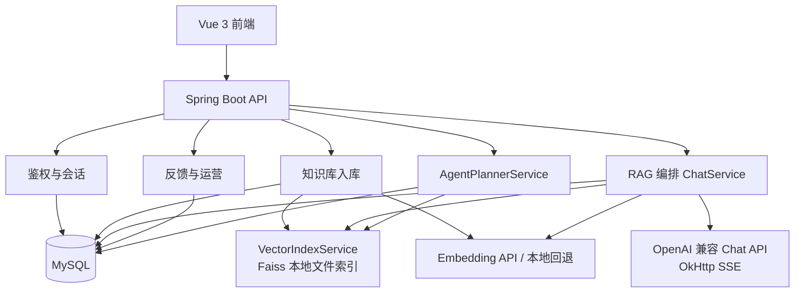
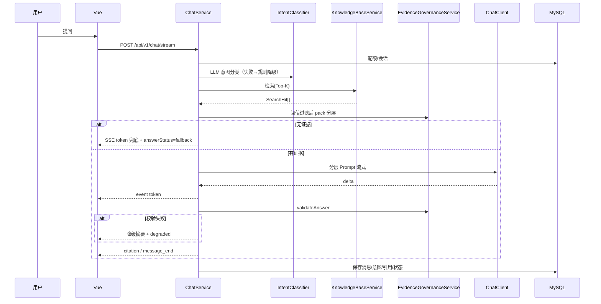
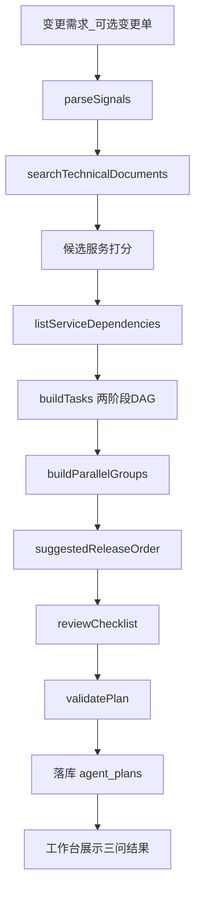
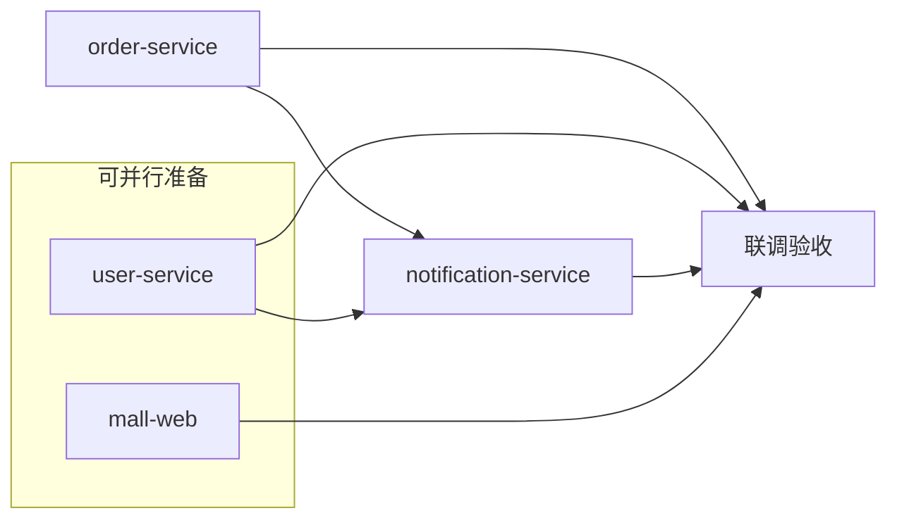

# AI架构设计


## 1. 设计目标

本项目 AI 架构同时覆盖：

1. 企业知识客服问答（RAG + SSE）
2. 研发变更规划 Agent（技术库检索 + 服务依赖 DAG）

架构目标：

1. 完整实现上传 → 向量化 → 检索 → Prompt → LLM → 流式返回
2. 回答可引用、可追溯；空检索不编造
3. 处理上下文过长与幻觉（分层证据 + 数字一致性校验）
4. 第 6 点 Agent 作为独立模块落地（与客服 RAG 隔离）

## 2. 总体逻辑架构



说明：Agent **当前不调用 LLM 生成 DAG**，以检索 + 规则/依赖表规划为主，避免无证据空想服务名。

## 3. 技术实现基线（与代码一致）

| 层级 | 实现 |
| --- | --- |
| 后端 | Java 21、Spring Boot 3.3、Spring MVC、Security+JWT、JPA |
| 流式 | `SseEmitter`（`ChatController` / `ChatService`） |
| LLM/Embedding | `OpenAiCompatibleChatClient` + `LlmCallRetry`（超时/429/5xx 指数退避）；`EmbeddingClient` |
| 向量 | `VectorIndexService`：Faiss 本地文件模式（IndexFlat 精确余弦落盘，`FAISS_INDEX_DIR`；无需独立向量服务） |
| 前端 | Vue 3 + TS + Vite + Pinia + Element Plus |

## 4. 客服问答 RAG 完整流程



### 4.1 模块职责

| 模块 | 职责 |
| --- | --- |
| 鉴权会话 | 注册登录、JWT、会话历史、每日提问上限 |
| 知识入库 | `.txt/.md/.pdf` 解析切块；`processing→ready/failed` 异步向量化；删除同步清向量 |
| RAG 编排 | **LLM 意图**（失败则规则降级）→ 检索 → `EvidenceGovernanceService` → Prompt → SSE → 一致性校验 |
| 反馈运营 | 点赞点踩、概览指标、兜底率等 |

### 4.2 增量更新

新文档只 upsert 本文件切块向量，不重建整库；删除按 `vector_id` 清理。。

## 5. AI Agent 任务拆解（Read.md 加分项 6，已落地）

> 题目要求：收到需求 + 技术/接口文档后，判断 **改哪些微服务 / 哪些可并行 / 哪些必须串行**；可用流程图或示例；项目内实现更好。  
> 本系统实现为「研发变更规划」工作台（规划 Agent），**不自动改多仓代码**。

代码：`AgentPlannerService`、`POST /api/v1/agent/decompose`、前端「研发变更规划」页。

### 5.1 三个问题 ↔ 实现

| 问题 | 实现方式 | 主要输出字段 |
| --- | --- | --- |
| 改哪些微服务？ | 技术库检索（`serviceCode`）+ 语义信号启发 + 人工范围加权 | `impactedServices`、`evidenceHits` |
| 哪些可并行？ | `executionMode=parallel` 且 `dependsOn` 空 | `parallelGroups` |
| 哪些必须串行？ | 读 `service_dependencies` 两阶段挂边 + 领域兜底 | `tasks.dependsOn`、`dependencyEdgesUsed`、`suggestedReleaseOrder` |

### 5.2 总览流程图（与代码步骤一致）



### 5.3 示例：下单后发短信（对照三问）

需求：`用户下单完成后，自动向用户手机号发送短信，并在前端成功页展示结果。`

1. **改哪些**：order-service（事件）、user-service（手机号）、notification-service（短信）、mall-web（文案）  
2. **可并行**：手机号查询、前端成功文案  
3. **必须串行**：订单事件契约 → 通知消费（依赖订单+用户）→ 联调验收  



边界：输出**规划与 DAG**，不自动改多仓业务代码；详情见 `项目说明.md` §4。

## 6. Prompt 设计

### 6.1 System Prompt（有证据，与代码对齐）

```text
你是电商平台的企业智能客服助手，请使用简体中文回答。
[意图专属约束：售后/投诉/闲聊/产品咨询]
必须遵守：
1. 只能使用「知识库证据」中编号条目，禁止编造政策/价格/时效/运费。
2. 证据分层：must_keep_policy 优先；background 不得单独立规。
3. 依据不足须明确写出并追问。
4. 冲突时政策层优先，禁止把不同编号混写成新规则。
```

### 6.2 User Prompt 拼接方式

1. `用户意图` + `用户问题`  
2. 三层证据块：`[E1] 文档=…；类型=…；内容=…`  
3. 输出要求：关键数字须能在证据中找到；可标注（依据 E1/E2）；禁止猜测  

无证据：不调用自由编造细则；`ChatService` 直接兜底话术。

### 6.3 减幻觉优化思路

| 点 | 做法 |
| --- | --- |
| 证据边界 | 编号强制引用 |
| 分层 | 政策优先 + 背景摘要 |
| 意图 | 售后/投诉更低 temperature |
| 空检索 | 硬阈值，无软塞弱证据 |
| 后校验 | 回答数字须出现在证据中，否则 `degraded` |

### 6.4 Agent 说明

Agent **不以 LLM System Prompt 生成服务列表**；规则锁定服务集合与 `dependsOn`。若未来加 LLM，仅允许润色文案，禁止改边（见 `项目说明.md` §4.5）。

## 7. 向量检索策略（Read.md 要求）

流水线：`KnowledgeBaseService.search*` → 阈值过滤 → `EvidenceGovernanceService.pack`。

| 参数 | 默认 | 配置 | 原因 |
| --- | --- | --- | --- |
| Top-K | 12 | `RAG_TOP_K` | 先宽召回，再阈值+分层收缩 |
| 阈值 | 0.22 | `RAG_SCORE_THRESHOLD` | 兼顾远程 Embedding 与本地哈希；过低易幻觉，过高易空检索 |
| 上下文预算 | 6000 字 | `RAG_MAX_CONTEXT_CHARS` | 政策约 45% / 高相关 40% / 背景 15% |
| 自动路由 | `kbId≤0` | — | 跨客服库选最高分库 |

Agent 技术库：`DEFAULT_TECHNICAL_KB_ID`，缺失时回退 `kb_type=technical_docs`。

## 8. 大规模检索保障

实现类：`EvidenceGovernanceService`。

1. 去重 / 相邻合并  
2. 三层预算入模 + 背景抽取式摘要  
3. 分层 Prompt  
4. `validateAnswer` 数字一致性 → 失败降级  

验证：冲突题看政策层；提高 Top-K 看 `evidencePacking`；追问不存在天数看 `degraded`。

## 9. SSE 事件

| 事件 | 含义 |
| --- | --- |
| `message_start` | messageId / conversationId / kbId / intentLabel / evidencePacking |
| `token` | `{ "delta": "..." }` |
| `citation` | 文档名 + snippet 列表 |
| `message_end` | answerStatus / followUpSuggestions / traceId |
| `error` | 流失败 |

`answerStatus`：`success` / `fallback` / `degraded` / `streaming`

