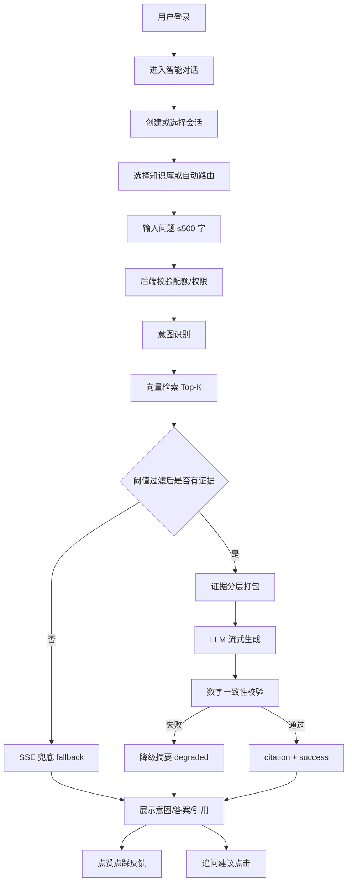
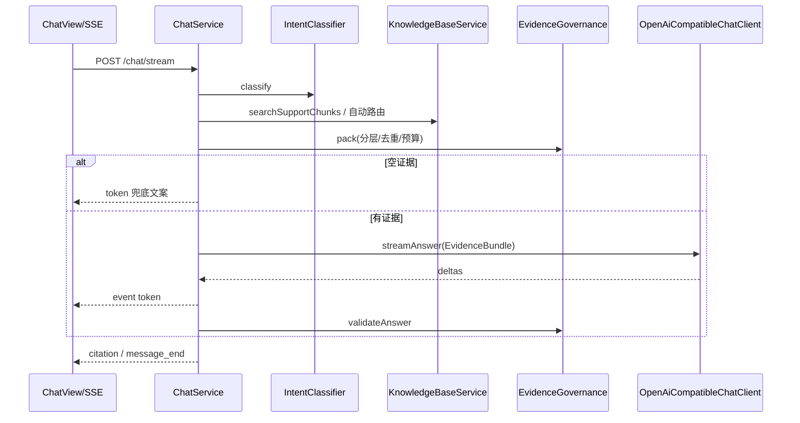
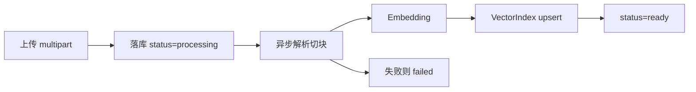
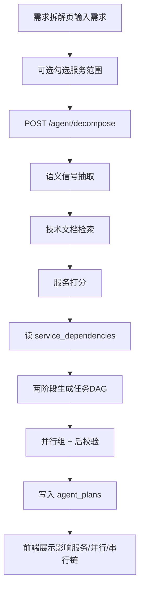

# 业务流程说明


## 1. 客服问答主流程



## 2. 登录与会话

### 2.1 登录

1. 邮箱+密码或手机号+密码  
2. 后端校验并签发 JWT  
3. 前端保存 token，后续 REST/SSE 带 `Authorization`

### 2.2 会话

1. 侧栏拉取历史会话列表  
2. 点选会话加载完整消息（含意图标签、引用、状态）  
3. 新会话可指定 `kbId`；问答时 `kbId≤0` 触发多库自动路由  

## 3. 问答详细链路

### 3.1 前置校验

1. 提问长度 ≤ 500  
2. 当日提问未超 `DAILY_QUESTION_LIMIT`（默认 100）  
3. 会话归属当前用户  

### 3.2 后端处理时序



### 3.3 前端渲染

1. `message_start`：占位助手气泡，写入 `intentLabel`  
2. `token`：逐字追加  
3. `citation`：右侧/底部引用来源（文档名 + 摘要）  
4. `message_end`：开放反馈与追问按钮；展示 `answerStatus`  

## 4. 知识库入库流程



增量语义：仅 upsert 新文档切块；删除文档时同步删除对应向量。不重建整库。

支持格式：`.txt` / `.md` / `.pdf`。

## 5. 反馈与运营

1. 用户对助手消息点赞/点踩并可填评论  
2. 写入 `message_feedback`  
3. 管理后台查看提问量、好评率、兜底率、低分问题  

## 6. Agent 拆解业务流程（加分项 6）



### 6.1 页面展示（已实现）

1. 规划状态 `success/partial/failed`  
2. 受影响服务及理由  
3. 可并行任务组  
4. 任务 DAG：串行链（依赖显示为任务名）+ 可并行区  
5. 验证步骤与缺失证据/校验提示  
6. 历史规划下拉切换  

### 6.2 示例需求

```text
用户下单完成后，系统应自动向用户手机号发送短信，并在前端成功页展示发送结果。
```

期望：

1. 改订单（事件）、用户（手机号）、通知（发短信）、前端（文案）  
2. 用户侧与前端可并行  
3. 通知依赖订单事件与用户数据；最后联调  

## 7. 异常分支

### 7.1 检索为空

1. 不调用 LLM 编造细则  
2. `answerStatus=fallback`  
3. 引导补充商品/订单等上下文  

### 7.2 LLM 失败或一致性校验失败

1. 回退分层证据摘要  
2. `answerStatus=degraded`  
3. SSE 仍可输出完整保守回答  

### 7.3 文档删除

1. 删 MySQL 文档与切块  
2. 按 `vectorId` 删向量索引  
3. 列表刷新  

### 7.4 Agent 证据不足

1. `status=partial` 或 `failed`  
2. `missingEvidence` 列出缺失文档/校验项  
3. 不假装拆解已充分  

## 8. 联调检查顺序（摘要）

1. MySQL /（可选）Qdrant  
2. Embedding / Chat API  
3. 登录 → 上传/种子文档 ready  
4. SSE 问答有引用与意图标签  
5. Agent 默认「下单发短信」拆解出并行/串行
