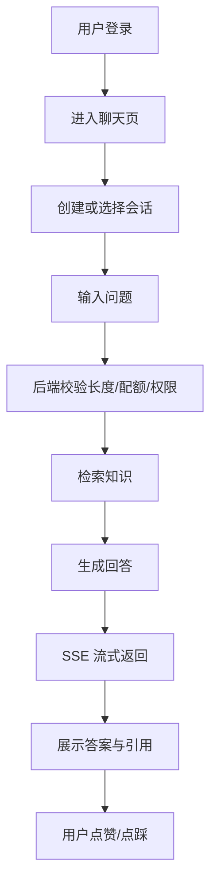
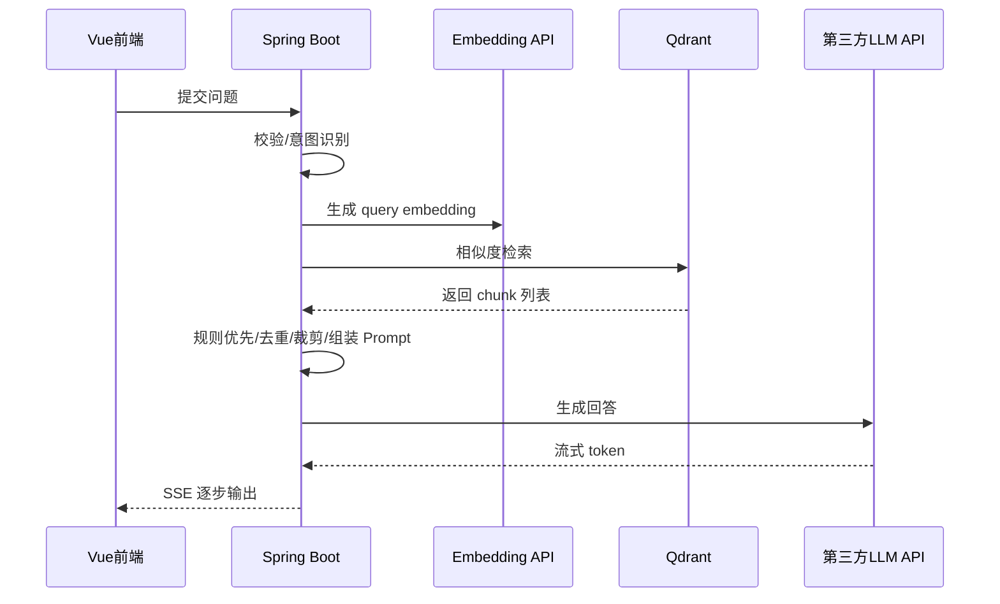
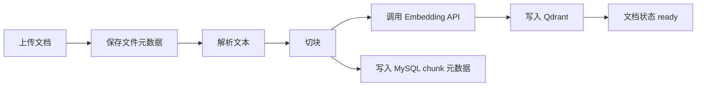
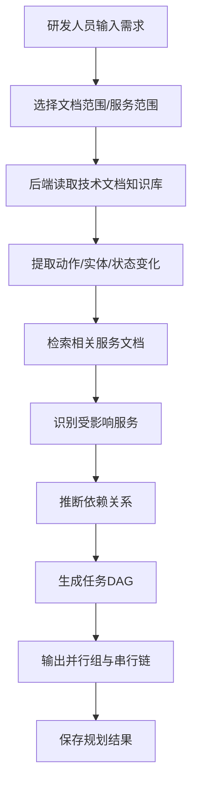

# 业务流程说明

## 1. 客服问答主流程



## 2. 登录与会话流程

### 2.1 登录

1. 用户通过邮箱+密码或手机号+密码登录
2. Spring Security 校验用户信息
3. 后端签发 JWT
4. 前端保存 token，并在后续请求中透传

### 2.2 会话管理

1. 进入聊天页时查询会话列表
2. 点击历史会话时拉取完整消息记录
3. 创建新会话时可指定默认知识库

## 3. 客服问答流程

### 3.1 用户提问

前置校验：

1. 单次提问不超过 500 字
2. 每日提问次数未超限
3. 会话属于当前用户

### 3.2 检索与生成



### 3.3 前端渲染

1. 收到 `message_start` 后创建占位消息
2. 收到 `token` 后不断追加文本
3. 收到 `citation` 后展示引用来源
4. 收到 `message_end` 后开放反馈与追问建议

## 4. 知识库入库流程



### 4.1 状态流转

1. `processing`
2. `ready`
3. `failed`

如果任一子任务失败：

1. 文档状态置为 `failed`
2. 写入 `ingestion_jobs.error_message`
3. 后台允许手动重试

## 5. 反馈流程

1. 用户对 AI 回答点赞或点踩
2. 可补充文本原因
3. 后端写入 `message_feedback`
4. 后台聚合统计，用于 Prompt 调优、知识库补充和错误分析

## 6. 管理侧流程

### 6.1 文档管理

1. 查看知识库与文档处理状态
2. 上传新文档
3. 删除失效文档
4. 查看失败任务并重试

### 6.2 运营分析

1. 问答量趋势
2. 点赞率 / 点踩率
3. 兜底率
4. 高频失败问题

## 7. README 第 6 点业务流程

这部分是“需求拆解 Agent”的真实业务链路。



### 7.1 Agent 规划结果展示

前端页面建议展示：

1. 需求原文
2. 受影响服务清单
3. 每个服务的改动原因
4. 并行任务组
5. 串行任务链
6. DAG 图
7. 验证步骤

### 7.2 示例

需求：

```text
用户下单后自动发送短信通知
```

流程：

1. 识别动作：下单成功、发送短信
2. 检索订单服务、用户服务、通知服务、前端商城文档
3. 推断订单服务先产出事件
4. 通知服务消费事件并依赖手机号数据
5. 前端提示文案与短信模板配置可并行
6. 输出任务 DAG 和验证建议

## 8. 异常分支

### 8.1 检索为空

1. 返回兜底话术
2. 记录 `answer_status=fallback`
3. 引导用户补充问题上下文

### 8.2 LLM 超时

1. 中断 SSE
2. 返回 `error` 事件
3. 前端提示系统繁忙

### 8.3 文档删除

1. 查出 `vector_id`
2. 删除 Qdrant points
3. 删除 MySQL 元数据
4. 更新前端列表

### 8.4 Agent 拆解证据不足

1. 不输出过度确定的结论
2. 明确提示缺少哪些服务或接口文档
3. 将状态标记为 `partial`
