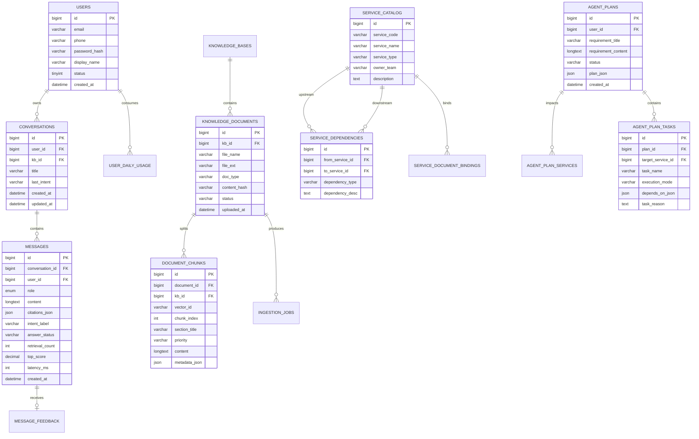

# 数据库设计

## 1. 设计目标

MySQL 负责存储两类核心数据：

1. 客服问答业务数据
2. 第 6 点 Agent 任务拆解业务数据

Qdrant 负责存储两类向量数据：

1. 客服知识库文档向量
2. 技术文档 / 服务文档知识库向量

## 2. ER 图



## 3. 客服问答相关表

### 3.1 `users`

用途：

1. 支持邮箱或手机号登录
2. 记录用户主体信息

### 3.2 `conversations`

用途：

1. 表示独立 Session
2. 绑定用户和默认知识库

### 3.3 `messages`

用途：

1. 保存用户消息与 AI 消息
2. 保存引用、相似度、耗时、回答状态

建议字段补充：

1. `trace_id`
2. `llm_model`
3. `request_source`

### 3.4 `message_feedback`

用途：

1. 保存点赞 / 点踩
2. 保存用户文本反馈

### 3.5 `knowledge_bases`

用途：

1. 支持多知识库
2. 支持客服文档库与技术文档库区分

建议字段：

1. `kb_type`：`customer_support` / `technical_docs`

### 3.6 `knowledge_documents`

用途：

1. 存储文档元数据
2. 记录入库状态

建议字段：

1. `doc_type`：`faq` / `policy` / `manual` / `service_spec` / `api_spec` / `event_spec`

### 3.7 `document_chunks`

用途：

1. 保存 chunk 与向量映射
2. 保存引用展示所需 metadata

建议 metadata：

1. `document_name`
2. `section_title`
3. `priority`
4. `service_code`（技术文档场景）
5. `page_no`

### 3.8 `ingestion_jobs`

用途：

1. 记录文档解析、向量化、写入任务状态
2. 支持失败重试

### 3.9 `user_daily_usage`

用途：

1. 控制每日提问上限
2. 为后台统计提供基础数据

## 4. 第 6 点 Agent 相关表

### 4.1 `service_catalog`

用途：

1. 保存系统中可被识别的服务目录
2. 作为 Agent 规划的服务主数据

关键字段建议：

| 字段 | 类型 | 说明 |
| --- | --- | --- |
| `service_code` | `varchar(64)` | 服务唯一编码 |
| `service_name` | `varchar(128)` | 服务名称 |
| `service_type` | `varchar(32)` | `backend` / `frontend` / `job` / `gateway` |
| `owner_team` | `varchar(128)` | 所属团队 |
| `description` | `text` | 服务职责说明 |

### 4.2 `service_dependencies`

用途：

1. 表达服务间依赖关系
2. 支撑 Agent 判断并行与串行任务

关键字段：

| 字段 | 类型 | 说明 |
| --- | --- | --- |
| `from_service_id` | `bigint` | 上游服务 |
| `to_service_id` | `bigint` | 下游服务 |
| `dependency_type` | `varchar(32)` | `api` / `event` / `data` / `config` |
| `dependency_desc` | `text` | 依赖说明 |

### 4.3 `service_document_bindings`

用途：

1. 建立服务与技术文档之间的映射
2. 便于 Agent 检索后回溯文档来源

### 4.4 `agent_plans`

用途：

1. 保存一次需求拆解结果
2. 便于查看历史、复盘和评估

关键字段：

| 字段 | 类型 | 说明 |
| --- | --- | --- |
| `requirement_title` | `varchar(255)` | 需求标题 |
| `requirement_content` | `longtext` | 需求原文 |
| `status` | `varchar(32)` | `success` / `partial` / `failed` |
| `plan_json` | `json` | 结构化规划结果 |

### 4.5 `agent_plan_services`

用途：

1. 保存本次规划命中的服务列表
2. 保存每个服务被命中的原因

### 4.6 `agent_plan_tasks`

用途：

1. 保存任务节点
2. 保存任务依赖

关键字段：

| 字段 | 类型 | 说明 |
| --- | --- | --- |
| `task_name` | `varchar(255)` | 任务名 |
| `execution_mode` | `varchar(32)` | `parallel` / `serial` |
| `depends_on_json` | `json` | 前置任务 id 列表 |
| `task_reason` | `text` | 拆解原因 |

## 5. 索引建议

### 5.1 问答业务

1. `users(email)` 唯一索引
2. `users(phone)` 唯一索引
3. `conversations(user_id, updated_at desc)`
4. `messages(conversation_id, created_at)`
5. `knowledge_documents(kb_id, status, uploaded_at desc)`
6. `document_chunks(document_id, chunk_index)`
7. `user_daily_usage(user_id, stat_date)` 唯一索引

### 5.2 Agent 规划

1. `service_catalog(service_code)` 唯一索引
2. `service_dependencies(from_service_id, to_service_id)`
3. `agent_plans(user_id, created_at desc)`
4. `agent_plan_tasks(plan_id)`

## 6. Qdrant Payload 设计

### 6.1 客服文档 payload

```json
{
  "kb_id": 1,
  "document_id": 12,
  "document_name": "退换货政策.txt",
  "chunk_index": 3,
  "section_title": "退款时效",
  "priority": "policy"
}
```

### 6.2 技术文档 payload

```json
{
  "kb_id": 2,
  "document_id": 51,
  "document_name": "order-service-api.md",
  "service_code": "order-service",
  "doc_type": "api_spec",
  "chunk_index": 7,
  "priority": "engineering"
}
```

## 7. 关键 DDL 参考

```sql
CREATE TABLE service_catalog (
  id BIGINT PRIMARY KEY AUTO_INCREMENT,
  service_code VARCHAR(64) NOT NULL,
  service_name VARCHAR(128) NOT NULL,
  service_type VARCHAR(32) NOT NULL,
  owner_team VARCHAR(128) NULL,
  description TEXT NULL,
  created_at DATETIME NOT NULL DEFAULT CURRENT_TIMESTAMP,
  updated_at DATETIME NOT NULL DEFAULT CURRENT_TIMESTAMP ON UPDATE CURRENT_TIMESTAMP,
  UNIQUE KEY uk_service_code (service_code)
);

CREATE TABLE service_dependencies (
  id BIGINT PRIMARY KEY AUTO_INCREMENT,
  from_service_id BIGINT NOT NULL,
  to_service_id BIGINT NOT NULL,
  dependency_type VARCHAR(32) NOT NULL,
  dependency_desc TEXT NULL,
  created_at DATETIME NOT NULL DEFAULT CURRENT_TIMESTAMP
);

CREATE TABLE agent_plans (
  id BIGINT PRIMARY KEY AUTO_INCREMENT,
  user_id BIGINT NOT NULL,
  requirement_title VARCHAR(255) NOT NULL,
  requirement_content LONGTEXT NOT NULL,
  status VARCHAR(32) NOT NULL,
  plan_json JSON NOT NULL,
  created_at DATETIME NOT NULL DEFAULT CURRENT_TIMESTAMP
);
```

## 8. 设计结论

这套数据设计同时支撑：

1. 客服问答主链路
2. 技术文档知识库
3. 需求拆解 Agent

因此更完整地满足 README 中关于数据库设计、知识库关联，以及第 6 点真实业务化实现的要求。
