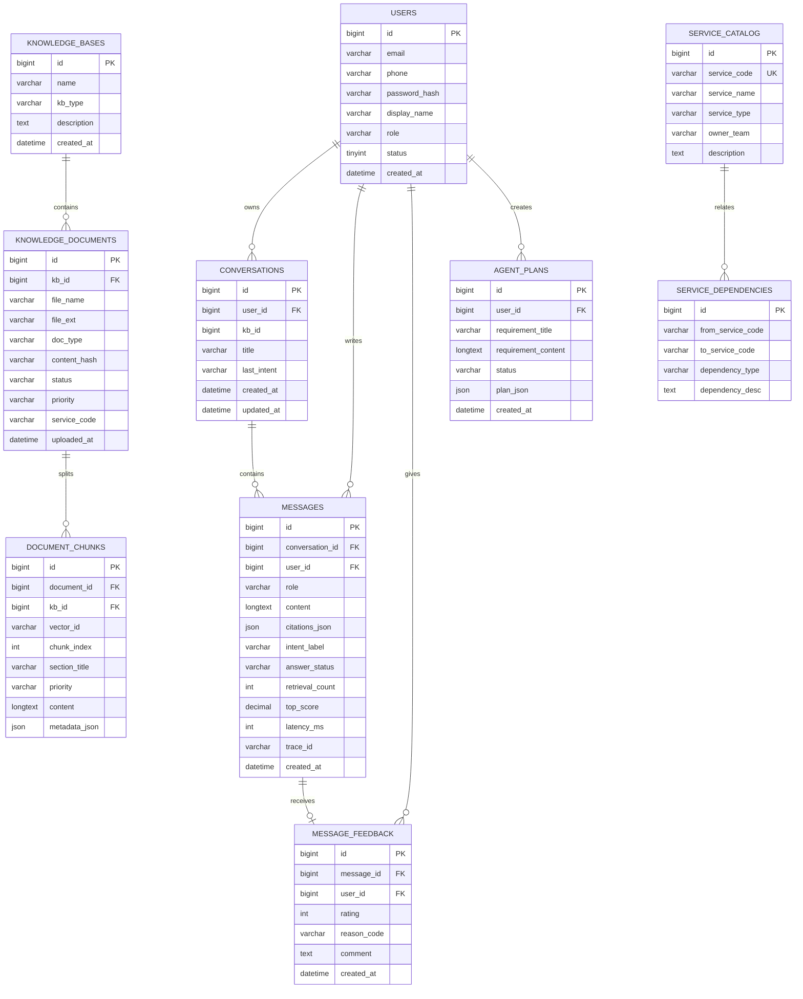

# 数据库设计


## 1. 设计目标

1. 支撑客服 RAG：用户、会话、消息、引用、意图、反馈、知识库与切块  
2. 支撑 Agent：服务目录、服务依赖、规划结果 JSON  
3. `document_chunks.vector_id` 关联向量索引，保证引用与删除同步  

## 2. ER 图（与现行实现一致）



说明：

- **未单独建** `agent_plan_tasks` / `agent_plan_services` 物理表：任务、并行组、验证步骤等写入 `agent_plans.plan_json`。  
- **未单独建** `ingestion_jobs`：文档状态用 `knowledge_documents.status`（`processing/ready/failed`）。  
- 每日配额当前按消息统计实现，可不依赖独立 usage 表。  

## 3. 客服相关表说明

### 3.1 `users`

邮箱注册与手机号注册分开：`email` / `phone` 均可为空（二选一必填），各自唯一；昵称 `display_name` 亦全局唯一；`role` 为 `USER` / `ADMIN`（仅 ADMIN 可访问管理后台；演示账号为 ADMIN，自注册默认为 USER）；邮箱后缀由业务白名单校验（qq/163/gmail 等）；`password_hash` 存 BCrypt。注册接口对同一账号+正确密码具备幂等性。

### 3.2 `conversations`

独立 Session；`kb_id` 为默认/最近绑定知识库；`last_intent` 记录最近意图。

### 3.3 `messages`

| 字段 | 用途 |
| --- | --- |
| `role` | `user` / `assistant` |
| `citations_json` | 引用列表（文档 id/名、chunk/vectorId、snippet） |
| `intent_label` | 产品咨询 / 售后问题 / 闲聊 / 投诉 |
| `answer_status` | `success` / `fallback` / `degraded` / `streaming` |
| `retrieval_count` / `top_score` / `latency_ms` | 可观测 |
| `trace_id` | 串联一次问答 |

### 3.4 `message_feedback`

`rating`：1 / -1；可选 `reason_code`、`comment`。

### 3.5 `knowledge_bases`

`kb_type`：`customer_support`（客服）/ `technical_docs`（Agent 技术库）。

### 3.6 `knowledge_documents`

| 字段 | 说明 |
| --- | --- |
| `doc_type` | 如 `policy` / `faq` / `api_spec` / `event_spec` |
| `status` | `processing` / `ready` / `failed` |
| `priority` | 如 `policy` / `engineering` / `general` |
| `service_code` | 技术文档绑定微服务编码 |
| `content_hash` | 内容摘要，便于去重判断 |

### 3.7 `document_chunks`

| 字段 | 说明 |
| --- | --- |
| `vector_id` | 向量点 ID，删除/引用关键 |
| `chunk_index` | 切块序号 |
| `content` | 切块正文 |
| `metadata_json` | 扩展元数据 |

## 4. Agent 相关表说明

### 4.1 `service_catalog`

Agent 可识别的服务主数据。种子含：`order-service`、`user-service`、`notification-service`、`mall-web`。

### 4.2 `service_dependencies`

用 **服务编码** 表达边（非外键 id）：

| 字段 | 说明 |
| --- | --- |
| `from_service_code` | 上游（先完成） |
| `to_service_code` | 下游（依赖上游） |
| `dependency_type` | `event` / `data` / `api` / `config` |
| `dependency_desc` | 说明 |

`AgentPlannerService` 读取该表生成任务 `dependsOn`。

### 4.3 `agent_plans`

| 字段 | 说明 |
| --- | --- |
| `status` | `success` / `partial` / `failed` |
| `plan_json` | 含 impactedServices、tasks、parallelGroups、validationSteps、missingEvidence |

## 5. 索引建议

1. `users(email)` / `users(phone)` 唯一（业务层保证）  
2. `conversations(user_id, updated_at)`  
3. `messages(conversation_id, created_at)`  
4. `knowledge_documents(kb_id, status)`  
5. `document_chunks(document_id, chunk_index)`  
6. `document_chunks(vector_id)`  
7. `service_catalog(service_code)` 唯一  
8. `agent_plans(user_id, created_at)`  

## 6. 向量侧 payload（逻辑模型）

Faiss 本地文件索引记录与 chunk 对齐，典型字段：

```json
{
  "kb_id": 1,
  "document_id": 12,
  "document_name": "退换货政策.txt",
  "chunk_index": 3,
  "vector_id": "...",
  "priority": "policy",
  "service_code": null
}
```

技术文档示例：`service_code: "order-service"`，`doc_type: "api_spec"`。

## 7. DDL 参考

完整参考：`backend/sql/schema.sql`。核心 Agent 表：

```sql
CREATE TABLE service_catalog (
  id BIGINT PRIMARY KEY AUTO_INCREMENT,
  service_code VARCHAR(64) NOT NULL,
  service_name VARCHAR(128) NOT NULL,
  service_type VARCHAR(32) NOT NULL,
  owner_team VARCHAR(128) NULL,
  description TEXT NULL,
  created_at DATETIME NOT NULL DEFAULT CURRENT_TIMESTAMP,
  updated_at DATETIME NOT NULL DEFAULT CURRENT_TIMESTAMP,
  UNIQUE KEY uk_service_code (service_code)
);

CREATE TABLE service_dependencies (
  id BIGINT PRIMARY KEY AUTO_INCREMENT,
  from_service_code VARCHAR(64) NOT NULL,
  to_service_code VARCHAR(64) NOT NULL,
  dependency_type VARCHAR(32) NOT NULL,
  dependency_desc TEXT NULL
);

CREATE TABLE agent_plans (
  id BIGINT PRIMARY KEY AUTO_INCREMENT,
  user_id BIGINT NOT NULL,
  requirement_title VARCHAR(255) NOT NULL,
  requirement_content LONGTEXT NOT NULL,
  status VARCHAR(32) NOT NULL,
  plan_json JSON NOT NULL,
  created_at DATETIME NOT NULL DEFAULT CURRENT_TIMESTAMP
);
```

## 8. 设计结论

1. 消息表同时承载**引用、意图、回答状态**。  
2. 切块 `vector_id` 把 MySQL 与向量索引绑在一起，满足删除同步与引用展示。  
3. Agent 用目录 + 依赖边 + `plan_json`，避免过度拆表，仍完整回答「改谁 / 并行 / 串行」。
