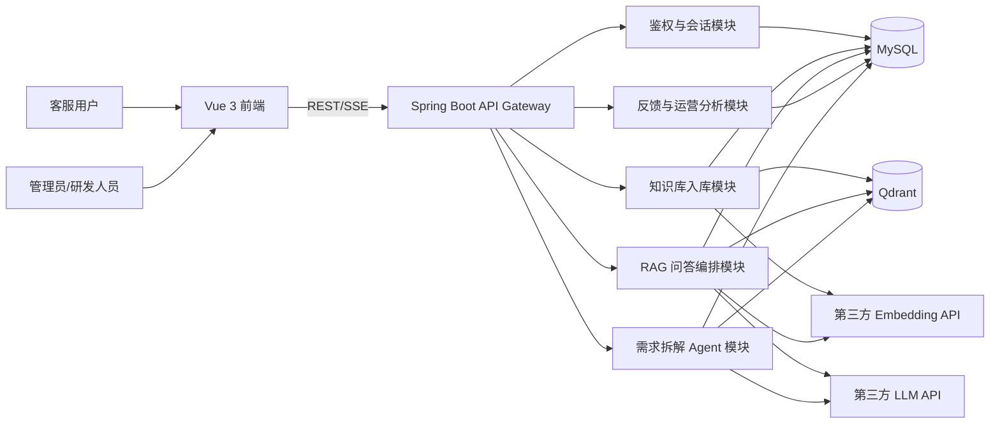

# 项目说明

## 1. 项目定位

本项目是一个面向企业场景的 AI 智能客服系统，目标是在 5 天交付周期内，完成一套基于大语言模型的企业知识问答方案，并进一步扩展出“研发需求拆解 Agent”能力，使系统更接近真实业务场景。

系统分为两条核心能力线：

1. 面向客服场景的 RAG 问答链路
2. 面向研发协同场景的需求拆解 Agent 链路

这样设计的原因是：

1. README 的主体要求是企业级智能客服。
2. README 评估标准第 6 点明确提出要思考多微服务需求拆解。
3. 在真实业务中，企业往往希望同一套 AI 平台既能服务外部客服，也能服务内部研发协作。

## 2. 推荐技术选型

### 2.1 总体选型

| 层级 | 选型 | 说明 |
| --- | --- | --- |
| 前端 | Vue 3 + TypeScript + Vite + Pinia + Vue Router | 符合 README 可选栈，适合聊天页、后台页、状态管理 |
| 组件库 | Element Plus | 适合企业后台、表格、对话框、上传组件 |
| 后端 | Java 21 + Spring Boot 3.3 | 符合 README 要求，适合企业级分层架构和 API 规范化 |
| Web 层 | Spring MVC + `SseEmitter` | 满足流式输出要求，兼顾实现复杂度和稳定性 |
| 安全 | Spring Security + JWT | 适合登录鉴权、接口保护和会话所有权控制 |
| 数据访问 | Spring Data JPA + MyBatis-Plus（二选一，首推 JPA） | JPA 适合主业务模型，复杂统计查询可补充原生 SQL |
| 关系数据库 | MySQL 8.4 | 存储用户、会话、消息、知识库、Agent 规划数据 |
| 向量数据库 | Qdrant | 支持 metadata filter、删除同步、知识库路由和技术文档检索 |
| 文档解析 | Apache PDFBox / CommonMark / 原生文本读取 | 覆盖 `.txt` / `.md` / `.pdf` |
| LLM 接入 | 第三方 OpenAI-compatible API 接口适配层 | 预留 `Base URL / API Key / Model` 配置，便于切换 OpenAI、通义千问兼容接口、Kimi、DeepSeek 等 |
| Embedding 接入 | 第三方 Embedding API 接口适配层 | 与生成模型解耦，支持单独切换 embedding 供应商 |
| 流式输出 | SSE | 满足 README 必做要求，前端可逐字渲染 |

### 2.2 技术选型原因

#### 为什么选 Vue 3

1. README 允许 Vue 3 + TypeScript。
2. Vue 3 在企业管理后台与业务表单场景中开发效率高。
3. 结合 Element Plus，适合快速搭建聊天页、文档管理页、管理后台和 Agent 规划页。

#### 为什么选 Spring Boot

1. README 明确允许 Java（Spring Boot）。
2. Spring Boot 适合做标准企业后端，分层清晰，便于展示工程能力。
3. Spring Security、JPA、Validation、SSE、OpenAPI 等生态成熟。
4. 更贴近真实业务中的多服务改造与 Agent 编排场景。

#### 为什么选“第三方 API 适配层”而不是本地 Ollama

这是根据你的新要求做出的方案调整。

1. 系统不绑定某个具体大模型厂商。
2. 通过统一的 `Base URL + API Key + Model` 配置，可以快速接入不同供应商。
3. 更接近真实企业实践：测试、预发、生产环境往往会切换不同供应商或不同模型。
4. 也更适合 README 第 6 点中的“Agent 根据文档自动拆解需求”，因为此类复杂规划任务通常更依赖高质量商用 API。

#### 为什么选 Qdrant

1. 支持向量 + metadata 检索，适合客服知识库与技术文档库共存。
2. 文档删除、知识库路由、服务文档过滤都更方便。
3. 后续做“受影响服务识别”时，可以直接检索服务说明、接口文档、事件文档和库表文档。

## 3. 系统总体架构



### 3.1 两条业务主链路

#### 客服问答链路

1. 用户提问
2. 检索知识库
3. 拼接 Prompt
4. 调用第三方 LLM
5. SSE 流式返回
6. 展示引用来源
7. 记录反馈和评估信息

#### 需求拆解 Agent 链路

1. 输入用户需求与系统技术文档
2. 检索服务目录、接口文档、事件文档、库表文档
3. 识别受影响的微服务
4. 判断并行任务和串行任务
5. 生成任务 DAG
6. 输出开发计划、依赖顺序、验证建议

## 4. 第 6 点如何实现

README 第 6 点不是单纯“写个流程图”就结束，而是可以设计成系统内部的一项真实能力。

### 4.1 能力定义

新增一个“研发需求拆解 Agent”模块，目标是输入：

1. 一条自然语言需求
2. 系统现有技术文档
3. 接口文档
4. 服务目录
5. 事件流/依赖关系描述

输出：

1. 涉及的微服务列表
2. 每个服务要改动的原因
3. 可以并行的任务集合
4. 必须串行的依赖任务
5. 建议的开发顺序与验收点

### 4.2 设计思路

拆解过程建议分成 5 个阶段：

1. 需求语义解析
2. 服务召回与候选筛选
3. 依赖关系推断
4. 任务图生成
5. 结果校验与人工确认

#### 阶段 1：需求语义解析

从自然语言需求中提取：

1. 业务动作
2. 业务实体
3. 状态变化
4. 外部通知/副作用

例如“用户下单后自动发送短信通知”会被拆成：

1. 动作：下单成功、发送短信
2. 实体：用户、订单、手机号、短信模板
3. 事件：订单状态变化

#### 阶段 2：服务召回与候选筛选

基于技术文档知识库检索：

1. 订单服务文档
2. 用户服务文档
3. 通知服务文档
4. 前端下单成功页面文档

然后结合规则筛选：

1. 直接拥有相关实体的服务优先
2. 直接发出或消费相关事件的服务优先
3. 与展示文案相关的前端服务保留为候选

#### 阶段 3：依赖关系推断

依赖可以从三类信息中推断：

1. API 依赖
2. 事件依赖
3. 数据依赖

例如：

1. 通知服务依赖订单服务先输出“下单成功事件”
2. 通知服务依赖用户服务提供手机号
3. 前端提示文案与后端事件实现可以并行

#### 阶段 4：任务图生成

把识别出的改动转成任务节点：

1. 更新订单服务事件定义
2. 更新通知服务消费逻辑
3. 更新短信模板配置
4. 更新前端成功提示文案
5. 增加联调与验收测试

再建立依赖边：

1. 事件定义 -> 通知服务改造
2. 通知服务改造 -> 联调测试
3. 前端提示文案可与短信模板配置并行

#### 阶段 5：结果校验与人工确认

为了降低 Agent 误判，最终增加一轮校验：

1. 是否每个任务都映射到了具体服务
2. 是否遗漏了数据来源服务
3. 是否把应当串行的依赖误判成并行
4. 是否包含了最小验证步骤

### 4.3 为什么这套设计更接近真实业务

因为真实研发团队中的需求拆解，不是只看“哪段代码像相关”，而是要同时考虑：

1. 微服务边界
2. API 契约
3. 事件流
4. 数据依赖
5. 联调顺序
6. 上线风险

这也是为什么本项目建议把第 6 点纳入系统内建能力，而不是写成孤立的“附加题”。

## 5. AI 工程重点思考

### 5.1 如何处理检索为空

1. 当向量检索无结果或最高分低于阈值时，直接走兜底分支。
2. 兜底话术必须明确说明“当前知识库没有足够依据”。
3. 禁止模型自由发挥。
4. 可引导用户补充更明确的上下文。

### 5.2 如何处理上下文超长

采用三层证据打包：

1. 强规则层：政策、SLA、禁答条款
2. 相关证据层：相似度较高的知识片段
3. 历史对话层：最近 N 轮消息

裁剪顺序：

1. 先去重
2. 再合并相邻片段
3. 最后做抽取式压缩

### 5.3 如何降低 LLM 幻觉

1. Prompt 强制“只能使用编号证据”，禁止混写不同文档规则  
2. 空检索直接兜底，不调用 LLM 编造细则  
3. 输出可标注（依据 E1/E2），消息侧携带引用 id  
4. 有证据时低 temperature（售后/投诉更低）  
5. 意图分类注入专属约束（售后禁估算天数、投诉禁乱承诺）  

#### Prompt 优化前后对比（摘要）

| 项目 | 优化前 | 优化后 |
|------|--------|--------|
| 证据约束 | “优先依据证据” | “只能用 [E#] 证据，否则说不确定” |
| 意图 | 无 | 四类意图 + 条件 Prompt |
| 温度 | 偏固定 | 有证据 0.1–0.15 / 无证据 0.4 |

人工验证建议见 `docs/AI架构设计.md` §6.3。

### 5.3.1 意图识别（加分项）

在调用 LLM 前由 `IntentClassifier` 完成分类，标签写入助手消息与会话 `lastIntent`，前端会话气泡展示：

- 产品咨询 / 售后问题 / 闲聊 / 投诉（对齐 README）
- 多信号加权打分 + 平局优先级（投诉 > 售后 > 产品 > 闲聊）
- 追问建议与 Prompt 约束随意图切换

### 5.4 如何满足大规模知识检索场景

这是对 README 加分项 5 的实现说明（详见 `docs/AI架构设计.md` §8）。

代码路径：`EvidenceGovernanceService` → `ChatService` → 分层 Prompt（`OpenAiCompatibleChatClient`）。

采用“规则优先 + 分层摘要 + 分步校验”：

1. 阈值过滤后按 `policy` 与相关度分成 `must_keep_policy` / `high_relevance` / `background`
2. 政策证据优先占用上下文预算（约 45%），背景层做抽取式压缩而非整段塞入
3. 同文档相邻片段合并、重复去重，统一编号 `E1…En`
4. Prompt 显式分三层并约定冲突时政策优先、禁止混写新规则
5. 生成后校验回答中的关键数字是否出现在证据中；失败则降级为证据摘要（`answerStatus=degraded`）
6. SSE 透出 `evidencePacking`，便于对照 Top-K 放大时的入模结构
## 6. 模块拆分建议

### P0 必做

1. 用户鉴权模块
2. 会话与消息模块
3. 知识库上传与索引模块
4. RAG 检索与生成模块
5. SSE 流式输出模块
6. 反馈与评估模块

### P1 加分

1. 意图识别
2. 追问建议
3. 管理后台
4. 多知识库路由
5. 大规模检索下的分层摘要与规则校验

### P2 终极挑战

1. 服务目录建模
2. 技术文档知识库化
3. 需求拆解 Agent
4. 任务 DAG 生成
5. 并行/串行任务识别

详细拆分见 [docs/任务拆解与SKILL映射.md](/C:/Users/far/Desktop/zhi/docs/任务拆解与SKILL映射.md)。

## 7. 推荐目录

```text
project/
├── backend/
│   ├── src/main/java/com/company/aics/
│   │   ├── api/
│   │   ├── application/
│   │   ├── domain/
│   │   ├── infrastructure/
│   │   ├── rag/
│   │   ├── agent/
│   │   └── config/
│   ├── src/main/resources/
│   ├── sql/
│   ├── pom.xml
│   └── README.md
├── frontend/
│   ├── src/
│   │   ├── api/
│   │   ├── views/
│   │   ├── components/
│   │   ├── stores/
│   │   ├── router/
│   │   └── composables/
│   ├── package.json
│   └── README.md
├── docs/
└── .codeartsdoer/skills/
```

## 8. 使用 AI 编程工具的说明

本节对应 README「特别说明：关于 AI 工具的使用」，记录本项目真实使用的工具、对 RAG 相关 AI 初稿的修正，以及回答质量验证方式。

### 8.1 使用了哪些 AI 工具

| 类型 | 工具 | 用途 |
|------|------|------|
| 编程助手 | Cursor（Composer / Agent） | 前后端脚手架、RAG/SSE、管理后台、Agent 拆解、文档草稿、问题排查 |
| LLM API（业务推理） | 阿里云 MaaS OpenAI 兼容接口，模型 `qwen-plus` | 客服流式问答生成 |
| Embedding API | 同工作空间兼容接口，模型 `text-embedding-v3` | 知识切块与查询向量化；失败时回退本地哈希向量 |
| 未使用 | LangChain / LlamaIndex | 为展示对 RAG 步骤的理解，检索—拼装—生成链路均为手写 |

配置方式见根目录 `.env.example` 与 `运行指南.md`（`LLM_*` / `EMBEDDING_*`）。演示账号：`demo@example.com` / `Passw0rd!`。

### 8.2 构建 RAG 链路时，对 AI 生成代码做过的优化与修正

AI 助手生成了相当比例的初稿（Controller、切块、OkHttp 调用、前端 SSE 解析等）。以下是人工或在助手协助下反复修正、对正确性影响最大的点：

1. **持久化路径纠偏**  
   初稿/中间态曾出现业务走内存 `DemoDataStore`、种子写 MySQL 的双轨问题。已统一为 `AppDataStore` + JPA/MySQL，并恢复启动类对数据源/JPA 的启用，保证会话、反馈与知识库元数据可持久。

2. **流式输出稳定性**  
   - 强制 HTTP/1.1、合理超时；Windows 下同步链路保留 PowerShell 回退。  
   - SSE 使用命名事件（`message_start` / `token` / `citation` / `message_end` / `error`），前端按帧解析，避免等整段再渲染。  
   - LLM 失败时降级为证据摘要流式输出，而不是整段挂死。

3. **空检索与弱相关“硬塞”问题**  
   早期存在低于阈值仍软回退进 LLM 的逻辑，易导致「订单发货」类问题串到退货政策并编造细则。已改为：**低于 `RAG_SCORE_THRESHOLD` 一律丢弃 → 标准兜底**，有证据才调模型。

4. **Prompt 与幻觉控制**  
   从笼统的「优先依据证据」改为：编号证据 `[E#]`、禁止混写不同文档规则、意图条件 Prompt、有证据时低温（售后/投诉更低）。详见 `docs/AI架构设计.md` §6。

5. **检索与入库工程化**  
   - Top-K=12、阈值默认 0.22、上下文 6000 字、入模最多 5 条，并在文档中写明原因。  
   - 文档状态 `processing → ready/failed` 异步向量化；删除时同步清向量。  
   - 多知识库自动路由（`kbId≤0`）跨客服库选最高分库。

6. **模型配置踩坑**  
   工作空间无 `deepseek-r1` 时上游返回 `model_not_found`，前端表现为「模型不可用，已回退为证据摘要」。已改为可用的 `qwen-plus`，并在 `.env.example` 同步。

7. **Agent 拆解**  
   初稿偏“一次 LLM 直接出 DAG”。现行实现为：技术库检索 + 服务目录启发 + 并行组规则 + 落库规划，避免无证据时空口拆服务。

### 8.3 如何评估和验证 RAG 回答质量

以**人工问答集 + 状态字段观测**为主（未接自动化评测平台），最小验证集如下：

| 用例 | 期望 | 如何判定 |
|------|------|----------|
| 「退货有时间限制吗？」 | 命中退换货政策；有引用；`answerStatus=success` | 引用文档名含政策；正文天数与证据一致 |
| 「订单多久发货？」 | 命中发货/物流相关 FAQ 或产品说明，**不串退货规则** | 引用与正文不出现无关退货条款 |
| 明显无关问题 | `fallback` 兜底话术，不编造细则 | `answerStatus=fallback`，无虚假数字 |
| 多轮追问 | `historyRounds` 携带最近 N 轮 | 第二问能承接第一问上下文 |
| 「我要投诉」 | 意图=投诉；语气安抚且不乱承诺赔偿 | 气泡意图标签 + 回答内容 |
| 上传新文档后提问 | 增量向量化后可检索到新内容 | 文档先 `processing` 再 `ready`，问答能引用新文件 |
| Agent：「下单后发短信」 | 标出订单/通知/用户等服务及并行/串行 | 规划页任务与依赖可读 |

回归方式：改 Prompt/阈值后，用同一批问题对比引用是否漂移、兜底率是否异常升高。管理后台可查看日提问量、好评率与兜底率作辅助。

### 8.4 数据初始化（对应 README 建议）

系统启动时由 `DataSeeder` 完成：

1. 预置客服库三篇文档（classpath `seed/`）：`公司产品介绍.txt`、`常见问题FAQ.md`、`退换货政策.txt`（合计约 2000–5000 字量级，便于测检索）。  
2. 预置技术文档库若干短篇，供 Agent 使用。  
3. 切块后写入 MySQL，并 **upsert 到向量索引**，启动后即可直接问答。  
4. 若库中已有用户，则跳过重复种子，仅对已有文档重建向量索引。

## 9. 结论

这套方案相较于简单的“客服问答 Demo”，更接近真实企业业务：

1. 外部有客服问答场景
2. 内部有技术文档与服务治理场景
3. AI 不只回答问题，还能帮助拆解研发需求

这也使得整个交付更完整地覆盖 README 对 AI 链路、工程思维、数据库与 API 设计、以及第 6 点终极挑战的要求。
